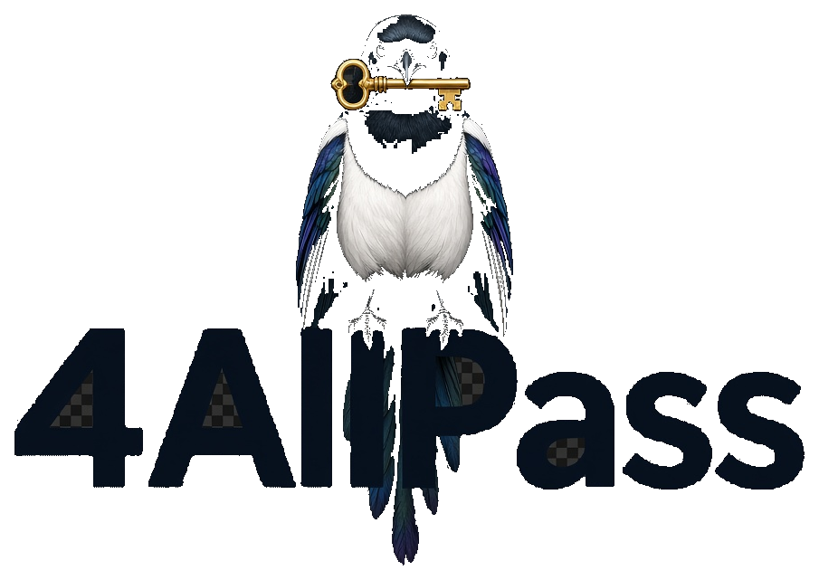

# 4AllPass

<p align="center"></p>

**Lokaler Passwort-Tresor.** Begrenzt Zugang für KI-Agenten, wenn du das willst.

```text
Browser → Tresor → Autofill
Agent → Access (Allow/Deny) — nicht der erste Bildschirm
```

Kein Cloud-Sync. Die Geräte besitzen den Tresor kryptografisch. **Produkt ist die Desktop-App** ([`docs/desktop.md`](docs/desktop.md)). Browser-Karten und Import: [`docs/browser-sync.md`](docs/browser-sync.md). Agent-Zugang bleibt im Access-Tab. FastAPI gibt **keine** Tokens aus.

Heute: selbst gehosteter Zero-Knowledge-Tresor, Argon2id, WebAuthn-Geräteentsperrung, PWA, Autofill in Chromium/Firefox/macOS Safari. Item-Share ist eine verschlüsselte Datei plus Share-Key; der Server sieht beides nicht. Umschlagen auf den Device Key einer anderen Person ist nicht in v1. Siehe [`docs/positioning.md`](docs/positioning.md).

---

## English

**A local-first password vault that lets you securely share limited access with AI agents.**

Self-hosted zero-knowledge vault. FastAPI never mints tokens. **Product is the desktop app** ([`docs/desktop.md`](docs/desktop.md)). Basics: browsers → vault → autofill ([`docs/browser-sync.md`](docs/browser-sync.md)). Agent Allow/Deny stays on the Access tab, not the first screen. Download: [Releases](https://github.com/landjunge/4AllPass/releases). Current builds are ad-hoc (macOS: right-click → Open). For strangers to double-click: Apple notarization — [`docs/distribution.md`](docs/distribution.md). Or `npm run app` on [http://127.0.0.1:8788](http://127.0.0.1:8788). Launch at login does not unlock the vault. WebAuthn PRF in the webview is unproven; master-password unlock is the supported path.

---

## Einrichten / Setup

**App zuerst.** Kein Postgres, kein Redis, kein zweites Terminal. Konto-Passwort ≠ Vault-Passwort. Logo inkl. Schriftzug.

### 1. Desktop (normal)

Download: [Releases](https://github.com/landjunge/4AllPass/releases) (prerelease, Tag `v*`). macOS-DMG nach Programme. **Aktuell ad-hoc:** Erstes Öffnen Rechtsklick → Öffnen. **Notarisierung pausiert** (Apple Developer ~99 USD/Jahr, Stand 2026-08-23 nicht leistbar) — [`docs/product-maturity.md`](docs/product-maturity.md), Anleitung [`docs/distribution.md`](docs/distribution.md). Tresor anlegen. Access-Broker läuft mit.

Selbst bauen:

```sh
git clone https://github.com/landjunge/4AllPass.git
cd 4AllPass
npm install
cd backend && python3 -m venv .venv && source .venv/bin/activate
pip install -r requirements-dev.txt
cd ..
npm run tauri:build
```

Windows-NSIS / Linux-AppImage entstehen in CI (`desktop.yml`) oder mit `npm run tauri:build:windows` / `:linux` auf dem jeweiligen OS.

Ohne Installer, ein Prozess: `npm run app` → [http://127.0.0.1:8788](http://127.0.0.1:8788). Dev-Fenster: `npm run tauri:dev`.

n8n (kein Marketplace-Node): Workflow [`examples/n8n-github-read.workflow.json`](examples/n8n-github-read.workflow.json) importieren, Pairing-Token als Header. Details: [`docs/local-access-broker.md`](docs/local-access-broker.md).

WebAuthn-PRF in der Webview ist unbewiesen; Unlock ist das Tresor-Passwort. Beim Anmelden starten entsperrt den Tresor nicht. [`docs/desktop.md`](docs/desktop.md).

### Server (Postgres, mehrere Nutzer)

Homebrew Postgres + Redis, wenn du die API auf einem Rechner für mehrere Clients betreibst — nicht nötig für die lokale App.

### 1. Postgres und Redis

```sh
brew install postgresql@17 redis
brew services start postgresql@17
brew services start redis

createuser fourallpass --pwprompt    # Passwort: fourallpass
createdb fourallpass -O fourallpass
```

User, Passwort und Datenbank heißen `fourallpass` (siehe `backend/.env.example`). User/DB überspringen, wenn sie schon existieren.

### 2. API und PWA

Dieses Mac: Port **8000** gehört einer anderen App → API **8010**, PWA **5173**. Ist 8000 frei: `--port 8000` und `API_ORIGIN` weglassen.

```sh
git clone https://github.com/landjunge/4AllPass.git   # oder bestehendes Clone
cd 4AllPass
npm install
cp -n backend/.env.example backend/.env
# in backend/.env: FOURALLPASS_SESSION_SECRET auf einen eigenen Wert setzen

cd backend
python3 -m venv .venv
source .venv/bin/activate
pip install -r requirements-dev.txt
alembic upgrade head
FOURALLPASS_SESSION_SECRET=dev-local-not-for-production \
  uvicorn app.main:app --host 127.0.0.1 --port 8010
```

Zweites Terminal:

```sh
cd 4AllPass/frontend
API_ORIGIN=http://127.0.0.1:8010 npm run dev -- --host 127.0.0.1
```

PWA-Dev mit Vite (zwei Prozesse, nur zum Frontend-Hacken): [http://127.0.0.1:5173](http://127.0.0.1:5173)

Dann: Konto anlegen → Tresor → Recovery-Kit bestätigen → Access-Tab (Zwei-Minuten-Demo).

GitHub sichtbar machen: [`docs/github-sichtbarkeit.md`](docs/github-sichtbarkeit.md).

### Optional: Docker

Nicht nötig. Wer Container will: `docker compose up --build` → PWA `:8080`, API `:8000`. Nicht parallel zum Native-Pfad (Ports 5432 / 6379 / 8000).

## Aufbau

| Pfad | Was es ist |
|---|---|
| [`packages/crypto`](packages/crypto) | `@4allpass/crypto` — Crypto Protocol v1. Kein UI, kein Netz, kein Authenticator-I/O |
| [`packages/webauthn`](packages/webauthn) | `@4allpass/webauthn` — Geräteentsperrung: PRF > largeBlob > UV-gespeicherter Store |
| [`packages/core`](packages/core) | `@4allpass/core` — Access-Policy, Grant-Metadaten, Audit. Kein Secret, kein React. `allow` = menschlicher Allow, nicht Auto-Handoff / policy allow means a human Allow, not auto-handoff |
| [`packages/providers`](packages/providers) | `@4allpass/providers` — Domain → Provider + Confidence. Lokal, kein Netz. |
| [`packages/access`](packages/access) | `@4allpass/access` — Loopback-Client für Agenten (`fourAllPass.request`). Nicht FastAPI |
| [`packages/broker`](packages/broker) | `@4allpass/broker` — Dev-Relay `:8787`. Produkt-Broker ist der Sidecar (`broker.py` auf `:8788`) / product relay is the sidecar |
| [`backend`](backend) | FastAPI. Lokal: SQLite + Memory-Sessions (`python -m app.local`). Server: PostgreSQL + Redis. Nur undurchsichtige Envelopes |
| [`frontend`](frontend) | React + TypeScript. Die gesamte Kryptographie läuft hier |
| [`src-tauri`](src-tauri) | Desktop-Fenster (Tauri). UI kommt vom lokalen Origin `:8788`, nicht aus einem Browser-Tab |
| [`extension`](extension) | Chromium-Familie + Firefox + macOS-Safari. Ein Source, drei Packs (`dist/chromium`, `dist/firefox`, `safari/`). Entschlüsselt auf dem Gerät über `@4allpass/crypto` |
| [`docs`](docs) | Die verbindlichen Spezifikationen |

Mitmachen: [`CONTRIBUTING.md`](CONTRIBUTING.md). Sicherheitsmeldungen: [`SECURITY.md`](SECURITY.md). Board: [4AllPass-Projekt](https://github.com/users/landjunge/projects/2).

## Warum dem trauen?

Der Server ist ein Blob-Store. Er sieht weder Master-Passwort noch Vault Key noch Klartext-Einträge. Das kannst du an öffentlichen Specs und Tests prüfen, nicht an einer Marketingseite:

- Was Backend + PWA **wirklich** erzwingen: [`docs/security-boundary.md`](docs/security-boundary.md)
- Bedrohungsmodell: [`docs/threat-model.md`](docs/threat-model.md)
- Adversarial Review des Crypto-Cores: [`docs/adversarial-review.md`](docs/adversarial-review.md)
- AES-256-GCM-KATs: [`docs/test-vectors.md`](docs/test-vectors.md)
- Argon2id-KATs: [`docs/test-vectors-argon2id.md`](docs/test-vectors-argon2id.md)
- Recovery (kein Server-Reset): [`docs/recovery.md`](docs/recovery.md)
- Audit-Karte für Dritte: [`docs/audit-scope.md`](docs/audit-scope.md)
- Reproduzierbarer PWA-/Extension-Tree-Hash: [`docs/reproducible-builds.md`](docs/reproducible-builds.md)

Es gibt **noch kein** unabhängiges Drittaudit. Geplanter Umfang: `docs/audit-scope.md`. Feature-Vergleich (ehrlich ✅ / ⏳): [`docs/comparison.md`](docs/comparison.md).

## Dokumentation

- Agent-Playbook (Review / Code / Improve): [`.cursor/skills/4allpass/SKILL.md`](.cursor/skills/4allpass/SKILL.md)
- Produktplan: [`docs/development-plan.md`](docs/development-plan.md)
- Positionierung (Ist-Behauptungen): [`docs/positioning.md`](docs/positioning.md)
- 8-Wochen-Plan Agent-Zugang: [`docs/eight-week-agent-access.md`](docs/eight-week-agent-access.md)
- Produktreife v3 (Autofill + kontrollierter Agent-Zugang, Konkurrenz-Lücken): [`docs/product-maturity.md`](docs/product-maturity.md)
- Browser-Sync (Karten, Profile, Basics): [`docs/browser-sync.md`](docs/browser-sync.md)
- Provider-Auflösung (Domain ≠ Provider): [`docs/provider-resolution.md`](docs/provider-resolution.md)
- Terminal-Install (ein Befehl, Pause ohne Apple): [`docs/install-terminal.md`](docs/install-terminal.md)
- Zwei-Minuten-Access-Demo: [`docs/two-minute-demo.md`](docs/two-minute-demo.md)
- Lokaler Loopback-Broker (optional, nicht FastAPI): [`docs/local-access-broker.md`](docs/local-access-broker.md)
- Installer für Fremde (Notarisierung / Signatur): [`docs/distribution.md`](docs/distribution.md)
- Launch-Artikel: [`docs/your-ai-agent-doesnt-need-your-api-keys.md`](docs/your-ai-agent-doesnt-need-your-api-keys.md)
- Launch-Post-Entwürfe: [`docs/launch-posts.md`](docs/launch-posts.md)
- GitHub sichtbar nutzen: [`docs/github-sichtbarkeit.md`](docs/github-sichtbarkeit.md)

- Crypto Protocol v1: [`docs/crypto-protocol.md`](docs/crypto-protocol.md)
- WebAuthn-PRF: [`docs/webauthn-prf.md`](docs/webauthn-prf.md)
- Vault-Revision / Rotation / Snapshot-Manifest: [`docs/vault-revision.md`](docs/vault-revision.md)
- Recovery Key & Emergency Kit: [`docs/recovery.md`](docs/recovery.md)
- Threat Model: [`docs/threat-model.md`](docs/threat-model.md)
- Adversarial Review: [`docs/adversarial-review.md`](docs/adversarial-review.md)
- Security Boundary (was wirklich läuft): [`docs/security-boundary.md`](docs/security-boundary.md)
- AES-256-GCM-Testvektoren: [`docs/test-vectors.md`](docs/test-vectors.md)
- Argon2id-Testvektoren: [`docs/test-vectors-argon2id.md`](docs/test-vectors-argon2id.md)
- Post-Quantum-Roadmap (nur Konzept): [`docs/post-quantum-roadmap.md`](docs/post-quantum-roadmap.md)
- Selektiver Item-Share (verschlüsselte Datei, v1): [`docs/sharing.md`](docs/sharing.md)

## Schlüsselpfad

```
Master-Passwort ──Argon2id──► Master Key ──unwraps──► Master Envelope ──► Vault Key
Recovery Key ─────────────────────────────unwraps──► Recovery Envelope ─► Vault Key
WebAuthn-Assertion + PRF ──HKDF──► DWK ──unwraps──► Device-Key Envelope ─► Device Key
                                                     Device Envelope ─────► Vault Key
```

Der Vault Key ist immer zufällig, nie aus einem Passwort abgeleitet. Roher PRF-Output ist nie ein Schlüssel.

## Projektstruktur

```
4allpass/
├── docs/                 verbindliche Specs
├── packages/crypto/      Zero-Knowledge-Crypto-Kern
├── packages/webauthn/    WebAuthn PRF / largeBlob / UV-Unlock
├── packages/core/        Access-Policy + Grant-Metadaten (kein Secret)
├── packages/access/      Agent-Loopback-Client
├── packages/broker/      Dev-Node-Relay :8787 (Produkt: Sidecar)
├── backend/              FastAPI + SQLAlchemy + Alembic + Redis
├── frontend/             React + TypeScript + PWA (Vite)
├── src-tauri/            Desktop (Tauri)
├── docker-compose.yml    optional; Native braucht das nicht
└── scripts/              unabhängige Testvektor-Prüfung
```

## Tests

```sh
npm install
npm test                    # KATs + Adversarial-Suite + core/broker
npm run test:crypto:heavy   # inkl. 32–128 MiB Argon2id-Profile
npm run test:webauthn
npm test -w @4allpass/core
npm test -w @4allpass/broker
npm run test -w @4allpass/frontend
npm run test:e2e -w @4allpass/frontend   # braucht Postgres, Redis und laufendes Backend
npm run test:e2e:live                    # sichtbares Chrome/Firefox/Brave/WebKit auf diesem Mac
# siehe docs/live-browser-test.md
npm run build -w @4allpass/extension
# siehe docs/autofill-extension.md
npm run typecheck
node scripts/generate-vectors.mjs
node scripts/verify-aes-gcm-vectors.mjs
pip install -r scripts/requirements-dev.txt
python3 scripts/verify-argon2id-vectors.py
```

## Backend

Konto- und Vault-HTTP-API (`/api/v1`). Das Konto-Passwort ist **nicht** das Master-Passwort und kann einen Tresor nicht entschlüsseln.

```
POST /api/v1/auth/register | login | logout
GET  /api/v1/auth/me
GET/POST /api/v1/vaults
GET      /api/v1/vaults/{id}
GET      /api/v1/vaults/{id}/snapshot
POST     /api/v1/vaults/{id}/snapshots    # CAS: expectedRevision
         /api/v1/vaults/{id}/devices…
POST     /api/v1/vaults/{id}/webauthn/challenges
POST     /api/v1/vaults/{id}/webauthn/challenges/{id}/consume
```

Jede Vault-/Device-/Snapshot-Route braucht `Authorization: Bearer`. Fremde Vaults liefern **404** (keine ID-Enumeration).

```sh
cd backend
python3 -m venv .venv && source .venv/bin/activate
pip install -r requirements-dev.txt
alembic upgrade head
uvicorn app.main:app --reload
pytest
```

Siehe [`backend/README.md`](backend/README.md).

## Docker Compose (optional)

Nicht der empfohlene Weg. Native: Abschnitt Einrichten.

```sh
docker compose up --build
```

Startet Postgres, Redis und das Backend auf `http://localhost:8000`.
