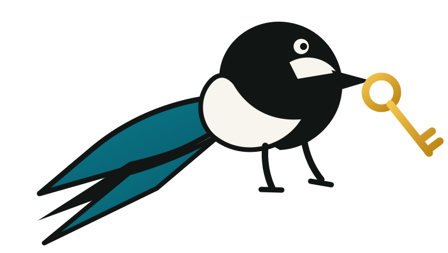

# 4AllPass

   
  

<strong>Ein digitaler Tresor, der wirklich dir gehört.</strong>

Lokaler Passwort-Manager. Autofill. Zero-Knowledge. Agenten nur nach Allow/Deny.

Local-first password manager. Autofill. Zero-knowledge. Agents only after Allow/Deny.

4AllPass speichert Passwörter und Zugänge auf deinem Gerät. Ein Anbieter oder Server soll sie nicht lesen können.

### 👤 [Für Nutzer – herunterladen und loslegen](#für-nutzer)

### 🛠️ [Für Entwickler – Code, Tests und Spezifikationen](#für-entwickler)

---

## Für Nutzer

### Einfach erklärt

Bei vielen Passwort-Apps liegen deine Daten bei einer Firma in der Cloud.
Bei 4AllPass liegt das Entscheidende bei dir: auf deinem Gerät und verschlüsselt.

**Das Produkt ist die Desktop-App.**

Du installierst sie, legst deinen Tresor an und übernimmst deine Passwörter aus dem Browser. Danach hilft dir 4AllPass beim Anmelden – ohne ständiges Kopieren und Einfügen.

### Was du davon hast

- Passwörter und Zugänge bleiben unter deiner Kontrolle.
- Autofill erledigt den Login für dich.
- Es gibt keinen verpflichtenden Cloud-Dienst.
- Synchronisierung ist optional und soll mit einem Server deiner Wahl funktionieren.
- Das Notfall-Kit ermöglicht Wiederherstellung ohne Server-Reset.
- KI-Tools erhalten später nur einzeln erlaubte Zugänge – niemals den ganzen Tresor.

### In drei Schritten

1. **Installieren** – Desktop-App herunterladen und starten.
2. **Übernehmen** – Passwörter aus Chrome oder Firefox prüfen und importieren.
3. **Anmelden** – Autofill auf einer Webseite ausprobieren.

[Desktop-Version herunterladen](https://github.com/landjunge/4AllPass/releases/tag/desktop) · [Produktseite ansehen](https://4allpass.netzwerkpunkt.de/)

### Was wir bewusst nicht machen

Wir bauen nicht gleichzeitig Blockchain, eine eigene digitale Identität und zwanzig Zukunftsfunktionen.

Zuerst muss 4AllPass im Alltag einfach und zuverlässig funktionieren: installieren, importieren, anmelden und wiederherstellen. Erst danach kommt mehr.

### Was heute funktioniert – ehrlich

| Bereich | Aktueller Stand |
|---|---|
| Produkt | Desktop-App; Entsperren mit Tresor-Passwort |
| Ablage | Local-first; Synchronisierung optional; kein angebotener Hosted-Dienst |
| Import | Chrome und Firefox; Prüfung ohne sichtbare Passwörter in der Liste |
| Autofill | Chromium, Firefox und Safari-Wrapper; kein automatisches Absenden |
| Zugriffsfreigabe | Zugriffe müssen lokal bestätigt werden |
| Recovery | Notfall-Kit; kein Zurücksetzen über den Server |
| WebAuthn PRF | Im Protokoll beschrieben; in der Desktop-Webview noch nicht bewiesen |
| Apple | Notarisierung wegen jährlicher Kosten pausiert |
| Sicherheitsprüfung | Noch kein unabhängiges Drittaudit |

Wichtig: 4AllPass ist noch eine Alpha-Version. Für wichtige Zugangsdaten braucht es weiterhin Vorsicht und ein sicheres Backup.

---

## Installation

### macOS und Linux

~~~sh
curl -fsSL https://raw.githubusercontent.com/landjunge/4AllPass/main/scripts/install.sh | sh
~~~

### Windows

~~~powershell
irm https://raw.githubusercontent.com/landjunge/4AllPass/main/scripts/install.ps1 | iex
~~~

Dafür brauchst du kein Node, Python, Docker oder Postgres. Der Installer verwendet den GitHub-Tag **desktop** und prüft SHA-256. Der Tresor-Ordner wird nicht gelöscht.

Die macOS-App ist noch nicht notariert. Deshalb kann beim ersten Start **Rechtsklick → Öffnen** nötig sein.

---

## Für Entwickler

4AllPass ist ein local-first Passwort-Manager mit Desktop-App, Browser-Erweiterungen und optionalem verschlüsseltem Speicher.

Der Server sieht keinen Klartext, kein Tresor-Passwort und keinen Vault Key. Was die Software tatsächlich erzwingt, steht in [Security Boundary](docs/security-boundary.md).

### Wie dieses Projekt entsteht

**System Designer & Product Architect: Daniel Filipek (landjunge)**

Produktvision, gewünschtes Verhalten, Grenzen und Prioritäten kommen von mir. KI unterstützt mich bei Implementierung, Tests und Dokumentation.

Ich bin kein klassischer Softwareentwickler und kein Security-Spezialist. Deshalb müssen Code, Spezifikationen und Tests überprüfbar bleiben.

Ich behaupte nicht, dass die Kryptografie sicher ist. Es gibt noch kein unabhängiges Drittaudit. Reviews, Tests und Versuche, das System zu brechen, sind ausdrücklich willkommen.

### Entwicklungsumgebung

Die folgenden Werkzeuge brauchst du nur für den Source-Build:

~~~sh
git clone https://github.com/landjunge/4AllPass.git
cd 4AllPass
npm install
cd backend
python3 -m venv .venv
source .venv/bin/activate
pip install -r requirements-dev.txt
cd ..
npm run build:extension
npm run tauri:dev
~~~

### Prüfen

~~~sh
npm test
npm run typecheck
cd backend && pytest
~~~

### Technische Dokumentation

- [Dokumentationsübersicht](docs/README.md)
- [Sicherheitsgrenze](docs/security-boundary.md)
- [Bedrohungsmodell](docs/threat-model.md)
- [Vault-Protokoll](docs/vault-protocol.md)
- [Recovery](docs/recovery.md)
- [Produktreife](docs/product-maturity.md)
- [Beitragen](CONTRIBUTING.md)
- [Sicherheitsprobleme melden](SECURITY.md)

Der Vault Key ist zufällig und wird niemals direkt aus dem Tresor-Passwort abgeleitet.

---

## English

4AllPass is a local-first desktop password manager. Autofill. Zero-knowledge. Agents get access only after Allow/Deny.

Import passwords from Chrome or Firefox, keep the vault on your device, and optionally self-host sync. There is no hosted cloud service. This is still alpha — there is no independent third-party audit yet.

Start with the [desktop release](https://github.com/landjunge/4AllPass/releases/tag/desktop). Product page: [4allpass.netzwerkpunkt.de](https://4allpass.netzwerkpunkt.de/). Technical details are in the [documentation index](docs/README.md).

---

**4AllPass beantwortet eine Frage: Darf ich zugreifen?**
Teil von [Netzwerkpunkt](https://netzwerkpunkt.de/) – eigenständig, local-first und unter deiner Kontrolle.
